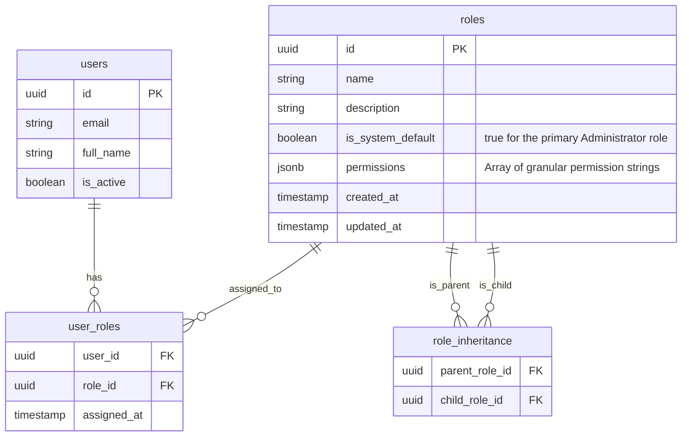

# Data Model: Tenant Roles & Permissions

## Entity Relationship Diagram

## Tables & Constraints (PostgreSQL)

**Schema Note**: All tables listed below reside within the isolated schema of each tenant (except `users` which might be in a shared `public` schema depending on the current global authentication strategy, though tenant associations apply).

### `roles`
- **Columns**:
  - `id` (uuid, primary key, default gen_random_uuid())
  - `name` (varchar, required, unique within tenant)
  - `description` (text, optional)
  - `is_system_default` (boolean, default false)
  - `permissions` (jsonb, default '[]'::jsonb) - Stores array of enum strings.
  - `created_at`, `updated_at` (timestamps)
- **Constraints**:
  - `name` must be unique.
  - If `is_system_default` is true, the row cannot be deleted (enforced via application logic or trigger).

### `user_roles`
- **Columns**:
  - `user_id` (uuid, references `users.id` ON DELETE CASCADE)
  - `role_id` (uuid, references `roles.id` ON DELETE RESTRICT)
  - `assigned_at` (timestamp, default now())
- **Constraints**:
  - Primary Key: `(user_id, role_id)`
  - Foreign Key constraint on `role_id` uses `ON DELETE RESTRICT` to satisfy the requirement: "prevent deletion of a role if there are active users assigned to it".

### `role_inheritance`
- **Columns**:
  - `parent_role_id` (uuid, references `roles.id` ON DELETE RESTRICT)
  - `child_role_id` (uuid, references `roles.id` ON DELETE CASCADE)
- **Constraints**:
  - Primary Key: `(parent_role_id, child_role_id)`
  - Check constraint or application logic to prevent `parent_role_id = child_role_id`
  - Foreign Key on `parent_role_id` uses `ON DELETE RESTRICT` to satisfy the requirement: "prevent deletion of a base role if other roles currently inherit from it".
